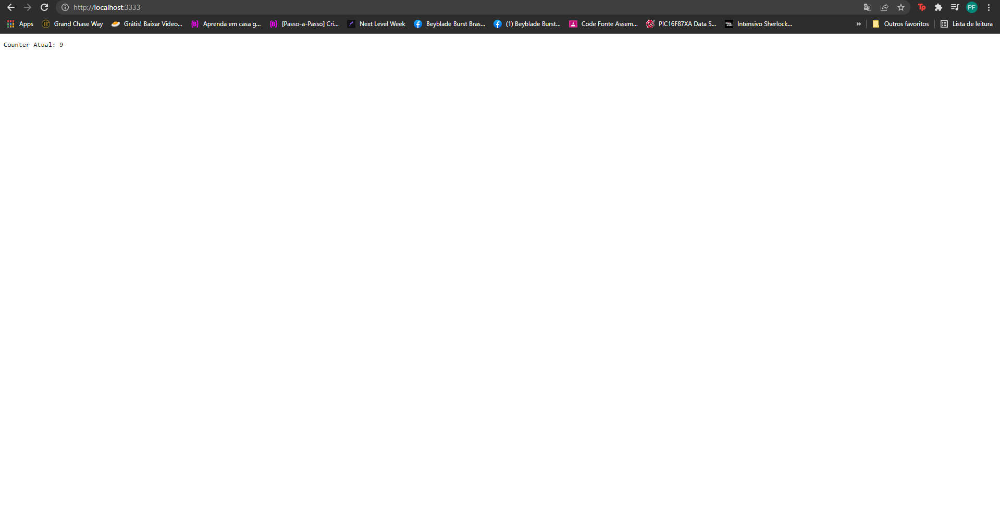

# First clone this project
```
    git clone https://github.com/FacundesPedro/testREADME.git
```
# To Run a nodejs http-Server

## On bash
```
    //Importante de setar variaveis de ambiente,se não PORT=8080
    PORT=ENV_PORT_VALUE node index.mjs

```
## On windows
```
    //Importante de setar variaveis de ambiente, se não PORT = 8080
    $env:PORT 8080
    node .\index.mjs //env "PORT" setada anteriormente!!
```
### Finnaly open tour browser or http-resquester tool and go to "http://127.0.0.1:PORT_ENV_VALUE" and see the value update in "database.txt" after each GET request the server receives

</img>